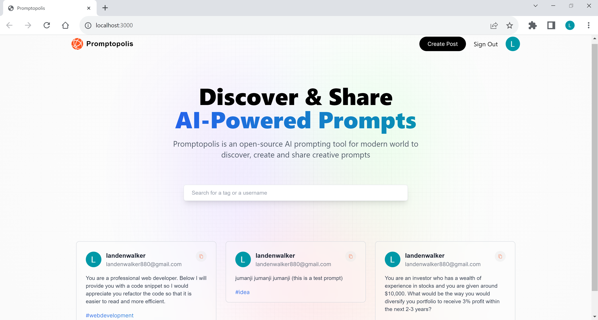

# Landen Promptopolis App

## Title

Landen Promptopolis App

# Table of Contents

- [GitHub](#github)
- [Description](#description)
- [Installation](#installation)
- [Usage](#usage)
- [License](#license)
- [How To Contribute](#howtocontribute)
- [Tests](#tests)
- [Screenshot](#screenshot)
- [Link](#link)

## GitHub

[Link](https://www.github.com/lwalker107)

## Email

landenwalker880@gmail.com

## Description

Application that allow users to log in with their google accounts and instantly create prompts that 
can be used for AI applications such as Chatgpt. Once a prompt is created, it will appear on the front page 
as apart of the feed and you can attach a tag to the prompt so that it is easier to filter through the prompts.

## Installlation 

npm i tailwindcss, bcrypt, mongodb, mongoose, next-auth, react-dom, postcss

## Usage

## License

MIT

## How to Contribute

You need to know my GitHub username, my email for questions and a working knowledge of Git.

## Tests

## Screenshot

## Link 
